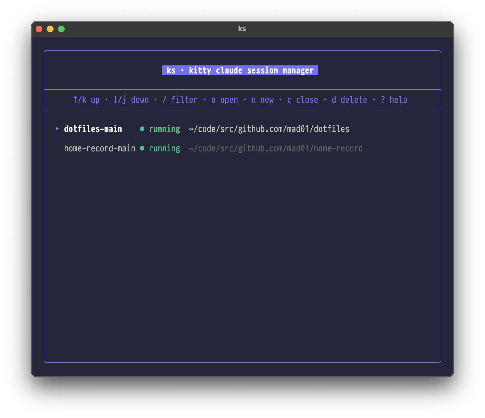
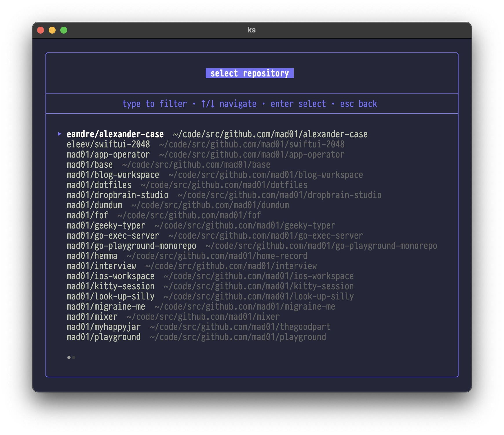
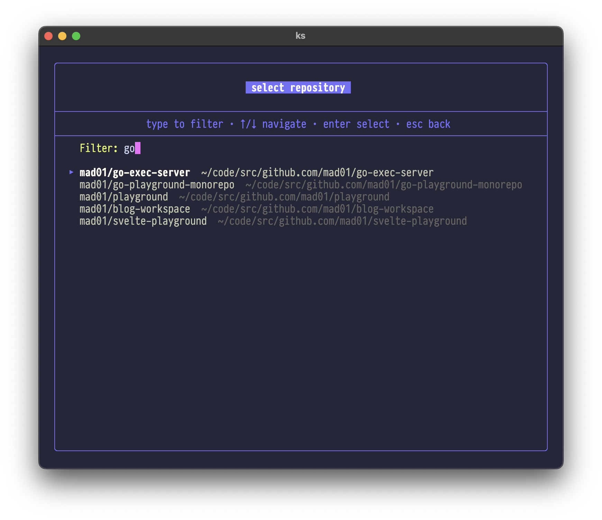
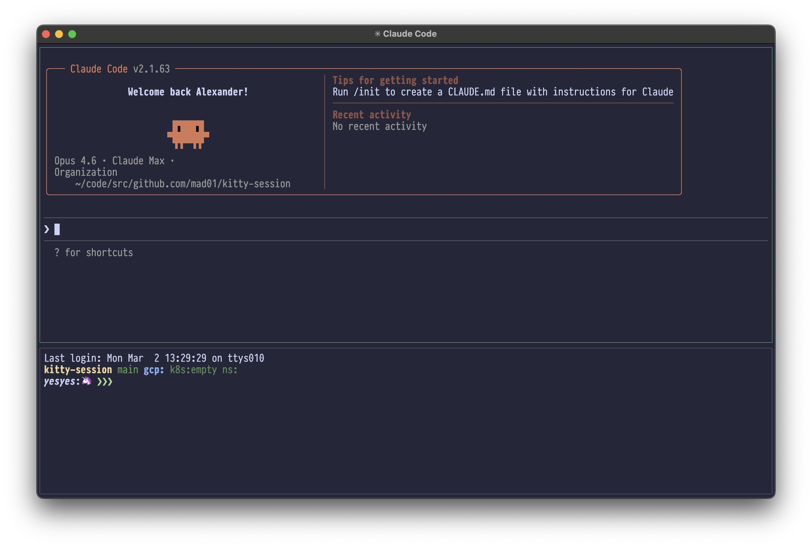
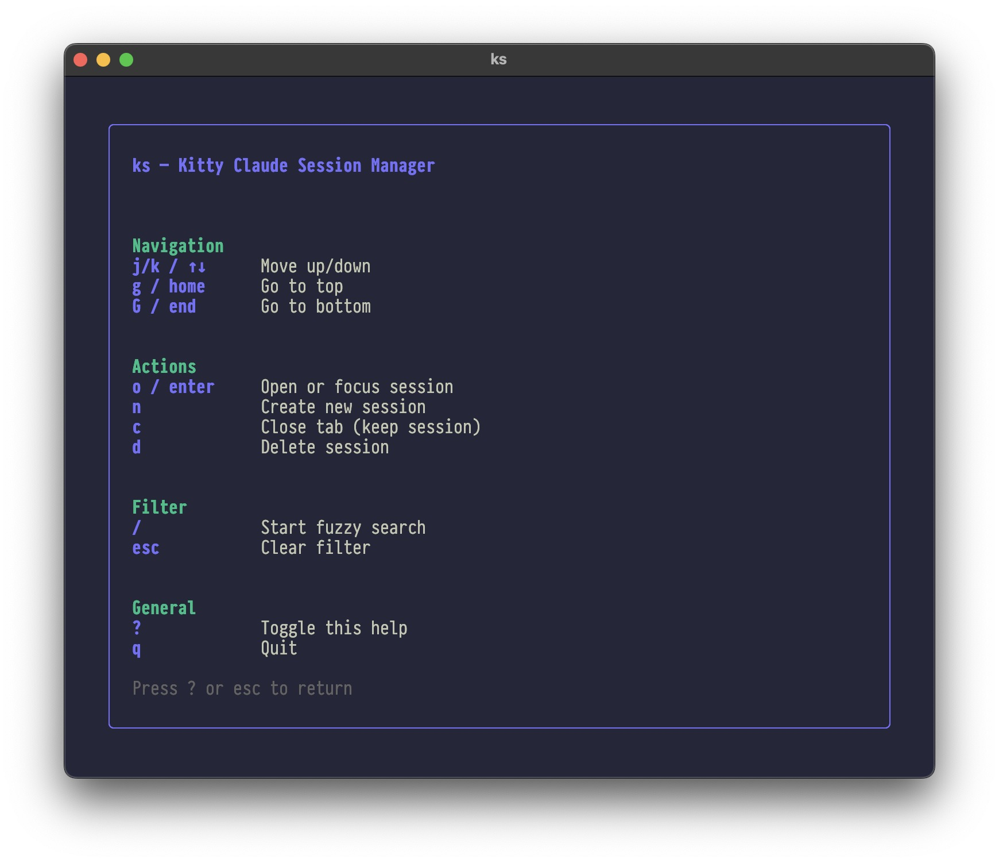

# kitty-session

Kitty Claude Session Manager — manage named kitty terminal sessions with Claude on top and a shell on bottom.

## Screenshots

### Session list

The main view lists all sessions with their status and working directory.



### Create a new session

Press `n` to open the repository picker. Browse all configured repos or type to fuzzy-filter.





### Open a session

Select a session and press `o` to open it. Each session is a kitty tab split with Claude Code on top and a shell on bottom.



### Help

Press `?` to see all available keybindings.



## Install

```bash
make install    # builds and copies ks to ~/code/bin/
```

## Usage

### TUI

```bash
ks              # launch interactive session manager
```

TUI keybindings:
- `j/k` Navigate sessions
- `o / enter` Open or focus session
- `n` Create new session (opens repo picker)
- `c` Close tab (keep session)
- `d` Delete session
- `/` Fuzzy search
- `?` Toggle help
- `q` Quit

### Subcommands

```bash
ks new -n <name> [-d <dir>]   # create session
ks open <name>                 # focus or recreate session
ks close <name> [--keep]       # close session tab
ks list                        # list all sessions
ks version                     # print version
ks repo                        # fuzzy repo finder
ks repo --list                 # list all repos
```

### Shell function

Add to your shell config to jump to a repo:

```bash
repo() { local d=$(ks repo); [[ -n "$d" ]] && cd "$d"; }
```

## Config

Repository directories are configured in `~/.config/ks/config.yaml`:

```yaml
dirs:
  - ~/code/src/github.com/mad01
  - ~/workspace
```
