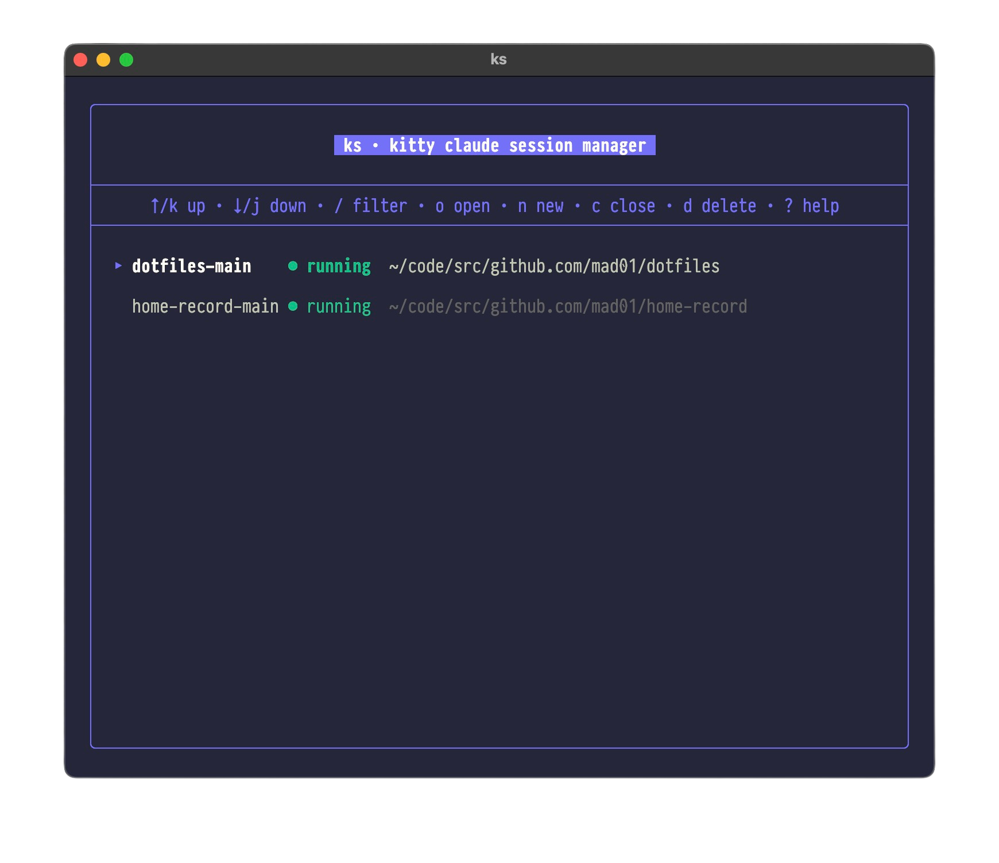
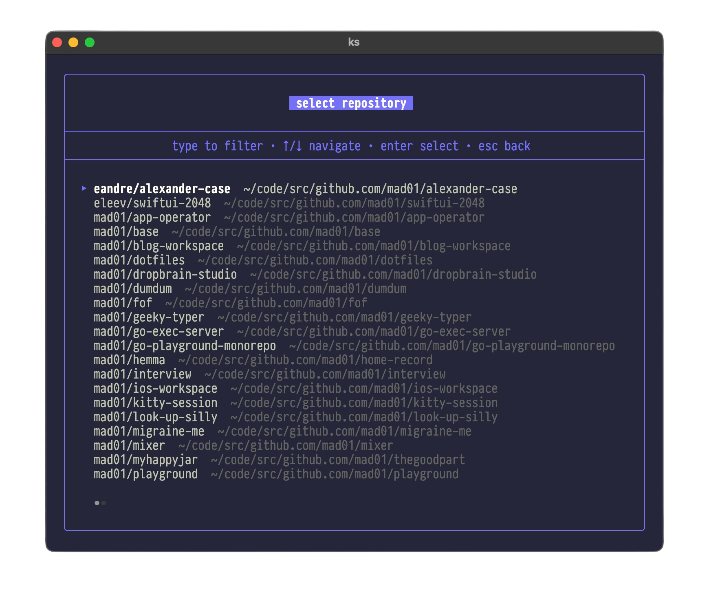
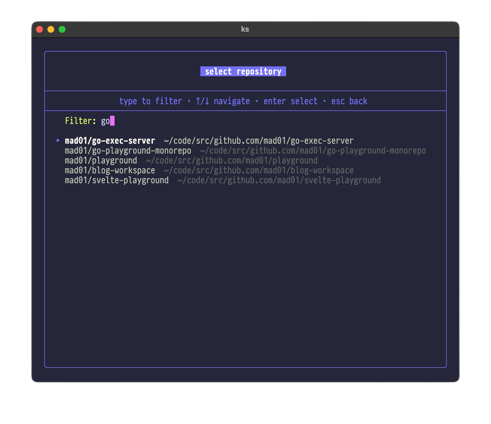
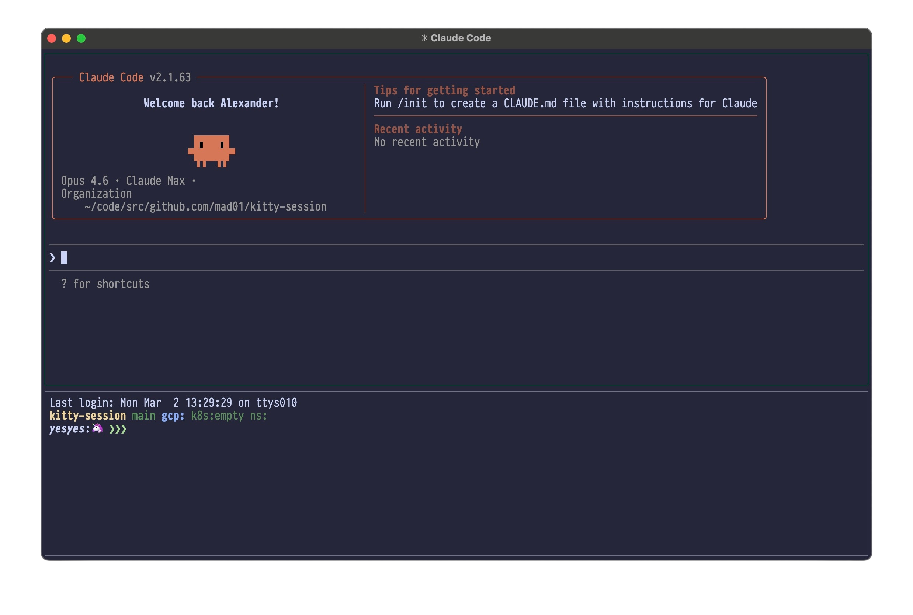
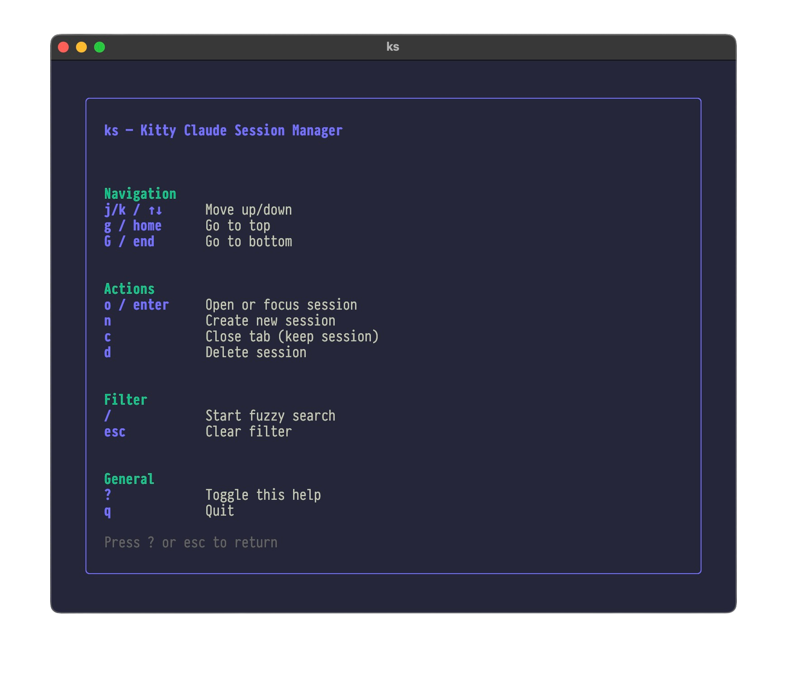

# kitty-session

Kitty Claude Session Manager — manage named kitty terminal sessions with Claude and a shell, using either a split layout (Claude on top, shell on bottom) or a tab layout (separate tabs).

## Screenshots

### Session list

The main view lists all sessions with their status and working directory.



### Create a new session

Press `n` to open the repository picker. Browse all configured repos or type to fuzzy-filter.





### Open a session

Select a session and press `o` to open it. Each session opens Claude Code and a shell — as a horizontal split (default) or as separate tabs.



### Help

Press `?` to see all available keybindings.



## Install

```bash
make install    # builds and copies ks to ~/code/bin/
```

## Usage

### TUI

```bash
ks              # launch interactive session manager
```

TUI keybindings:
- `j/k` Navigate sessions
- `o / enter` Open or focus session
- `n` Create new session (opens repo picker)
- `c` Close tab (keep session)
- `d` Delete session
- `/` Fuzzy search
- `?` Toggle help
- `q` Quit

### Subcommands

```bash
ks new -n <name> [-d <dir>]   # create session
ks open <name>                 # focus or recreate session
ks close <name> [--keep]       # close session tab
ks list                        # list all sessions
ks version                     # print version
ks repo                        # fuzzy repo finder
ks repo --list                 # list all repos
ks repo --json                 # list all repos as JSON
ks repo --toon                 # list all repos as TOON (token-optimized for LLMs)
```

### Output formats

`ks repo` supports multiple output formats for different consumers:

| Flag | Format | Use case |
|------|--------|----------|
| *(none)* | Interactive fuzzy finder | Human — pick a repo |
| `--list` | TSV (`name\tpath`) | Shell scripts, piping |
| `--json` | JSON array | Structured tooling |
| `--toon` | [TOON](https://github.com/alpkeskin/gotoon) | LLMs (30-60% fewer tokens than JSON) |

**`--json` example:**
```json
[
  {
    "name": "mad01/kitty-session",
    "path": "/Users/you/code/src/github.com/mad01/kitty-session"
  }
]
```

**`--toon` example:**
```
repos[1]{name,path}:
 mad01/kitty-session,/Users/you/code/src/github.com/mad01/kitty-session
```

### Shell function

Add to your shell config to jump to a repo:

```bash
repo() { local d=$(ks repo); [[ -n "$d" ]] && cd "$d"; }
```

## MCP Server

`ks mcp` starts an [MCP](https://modelcontextprotocol.io) stdio server that exposes the search, repo-lookup, and file-read functionality as native tools for Claude Code and other MCP clients. The subprocess is spawned per call by the MCP client — there is no long-running daemon, no port, no service to manage.

See [`docs/mcp.md`](docs/mcp.md) for the full tool reference (input/output schemas, query syntax, examples, troubleshooting).

### Tools

| Tool | Purpose |
|---|---|
| `ks_repo_lookup` | Resolve a repo name to its absolute local checkout path |
| `ks_search` | Search code across locally checked-out repos (zoekt syntax) |
| `ks_count` | Count matches grouped by repo or language |
| `ks_read` | Read a file from a named local repo |
| `ks_query_validate` | Validate a zoekt query and return its parsed tree |

`ks_search` and `ks_count` reuse the same gRPC search daemon that backs the cobra commands, so zoekt index shards stay mmap'd in memory across MCP calls.

### Register with Claude Code

```bash
claude mcp add --scope user ks -- ks mcp
```

That writes a user-scoped entry into Claude Code's config; Claude will see the `ks_*` tools in its tool list on the next session start.

### Smoke test

```bash
( printf '{"jsonrpc":"2.0","id":1,"method":"initialize","params":{"protocolVersion":"2024-11-05","capabilities":{},"clientInfo":{"name":"smoke","version":"0"}}}\n{"jsonrpc":"2.0","method":"notifications/initialized"}\n{"jsonrpc":"2.0","id":2,"method":"tools/list"}\n'; sleep 1 ) | ks mcp
```

Expected: one `initialize` response followed by a `tools/list` response containing the five `ks_*` tools with their input and output schemas.

## Config

Configuration lives in `~/.config/ks/config.yaml`:

```yaml
dirs:
  - ~/code/src/github.com/mad01
  - ~/workspace
layout: split  # "split" (default) or "tab"
tmpdir: ~/.config/ks/claude-session-workspaces  # optional
```

- `dirs` — parent directories to scan for repositories
- `layout` — `split` puts Claude and shell in a horizontal split (Claude on top 30%, shell on bottom 70%). `tab` creates separate kitty tabs for Claude and shell within the same OS window.
- `tmpdir` — base directory for scratch sessions created via the `tmp` picker item. Defaults to the OS temp directory when unset. Setting a custom path (e.g. `~/.config/ks/claude-session-workspaces`) keeps scratch workspaces in a predictable location that won't be cleaned up by the OS.
