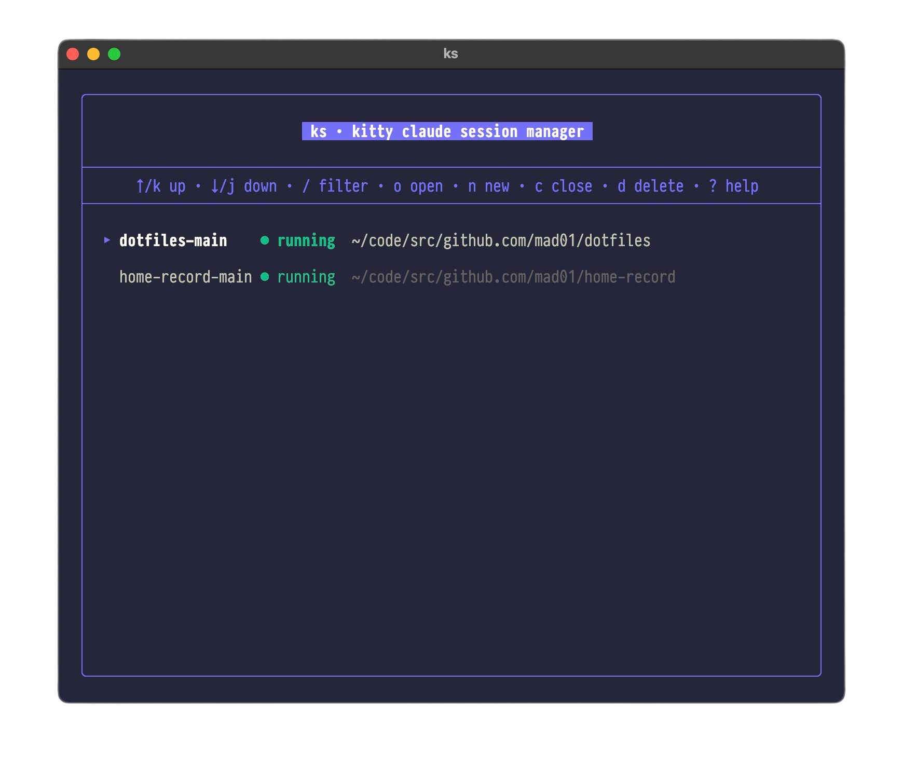
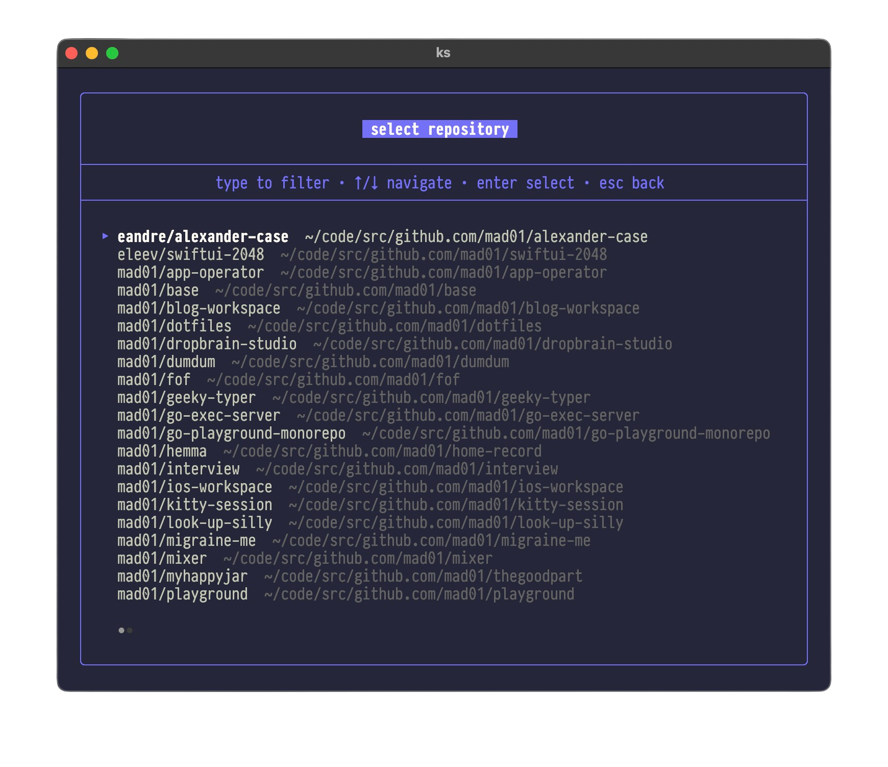
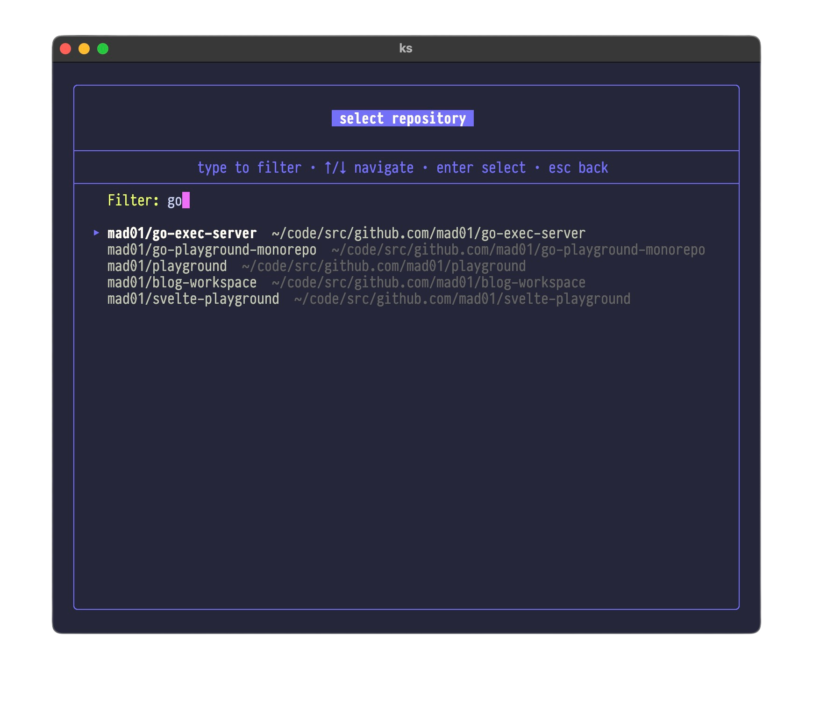
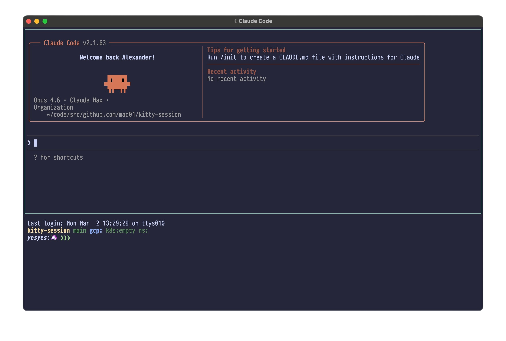
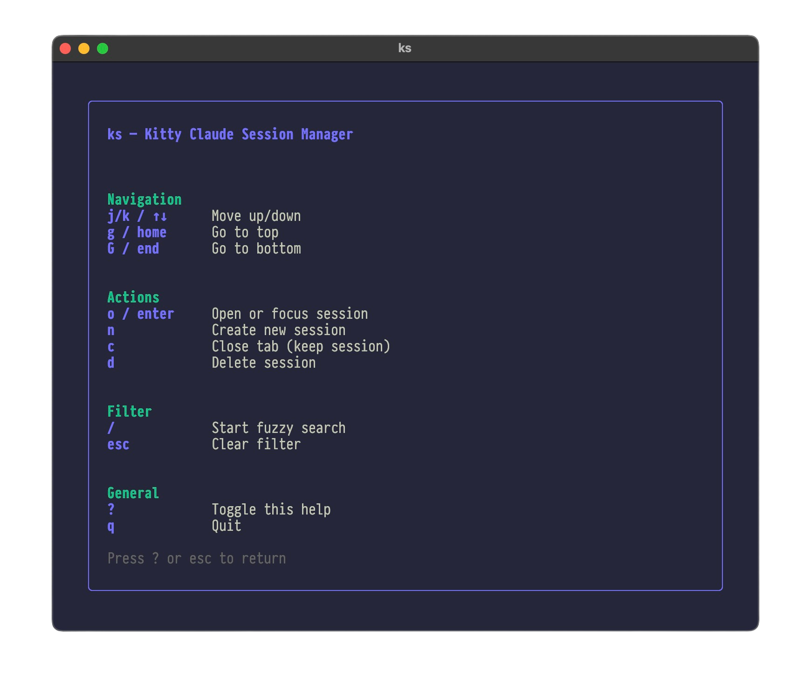

# kitty-session

`ks` is a session manager for [kitty](https://sw.kovidgoyal.net/kitty/). It runs a kitty instance of its own in which every [Claude Code](https://docs.claude.com/en/docs/claude-code/overview) session is a tab: the `ks` sidebar on the left, claude on the right. It tracks each session's state, brings every session back with one command, and lets you jump between them from the sidebar or shell scripts.

## Screenshots

### Session list

The sidebar lists every agent with its state and Claude's current tab title. (Screenshots predate the sidebar; run `ks _sidebar-demo` for a live preview on fake data.)



### Create a session

Press `n` to open the repository picker. Browse everything `ks` has scanned or type to fuzzy-filter.




### Inside a session

Each session tab pairs the sidebar with Claude Code. (Screenshots predate the sidebar layout.)



### Menu

Press `m` for every action, from new agent to quit.



## Install

You need [kitty](https://sw.kovidgoyal.net/kitty/) and the [Claude Code CLI](https://docs.claude.com/en/docs/claude-code/overview) on `PATH`; `ks` starts its own kitty instance. Go 1.25 or later is required to build from source.

```bash
make install
```

This builds `ks` and copies it to `~/code/bin/`. Adjust the `Makefile` or copy the binary yourself if you prefer another location.

For everything else — first session, configuration, subcommands, hooks — see the docs below.

## Documentation

- [Getting started](docs/getting-started.md) — install, minimal config, first session
- [Configuration](docs/configuration.md) — `~/.config/ks/config.yaml` reference
- [Sidebar guide](docs/tui.md) — rows, states, keys, menu, trash and restore
- [Command reference](docs/commands.md) — every subcommand and flag
- [Repo finder](docs/repo-finder.md) — `ks repo` and its output formats
- [Hooks and state detection](docs/hooks-and-state.md) — how `ks` knows what Claude is doing
- [Summary tab](docs/summary-tab.md) — deprecated, kept for the record
- [Architecture](docs/architecture.md) — package layout, data flow, extending `ks`
- [Troubleshooting](docs/troubleshooting.md) — common failures and fixes

## Code search

The MCP server, search daemon, and zoekt integration that used to live in this repo now live in [code-search-local (`csl`)](https://github.com/mad01/code-search-local). `ks` kept the `repo` subcommand so the shell `repo()` helper keeps working.
